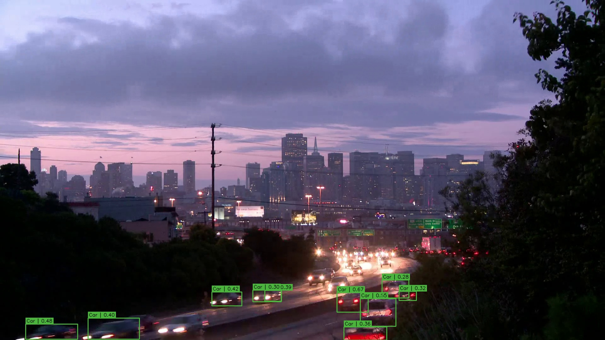
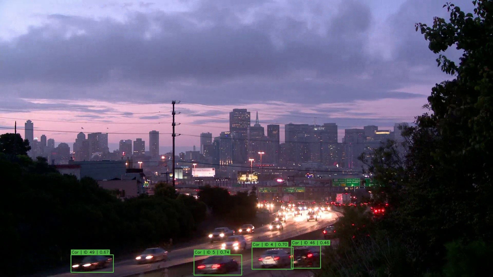

# Smart Traffic Monitoring System

Baseline Computer Vision project for vehicle detection and multi-object tracking.

Traffic video → YOLO11 → ByteTrack → bounding boxes, vehicle classes, and track IDs.

## Team

- Kha — vehicle detection
- Hoàng — multi-object tracking

## Current scope

The Week 1–2 baseline detects and tracks `car`, `motorcycle`, `bus`, and `truck` with a
COCO-pretrained YOLO11n model. Detection totals are frame-level observations, not a
unique traffic count.

## Setup

```bash
git clone <repository-url>
cd Traffic
python -m venv .venv
```

Windows:

```powershell
.venv\Scripts\Activate.ps1
python -m pip install -r requirements.txt
```

Linux/macOS:

```bash
source .venv/bin/activate
python -m pip install -r requirements.txt
```

## Sample data

Download the CC BY 3.0 demo video from
[Wikimedia Commons](https://upload.wikimedia.org/wikipedia/commons/2/28/Traffic_at_dusk_%28time_lapse%29.webm)
and save it as `data/samples/traffic.webm`. Attribution and license details are in
[`data/README.md`](data/README.md).

## Detection and tracking

```bash
python main.py --source data/samples/traffic.webm --mode detect --conf 0.25
python main.py --source data/samples/traffic.webm --mode track --conf 0.25
```

Optional arguments include `--model`, `--output`, and `--device`. Use
`python main.py --help` for details. Results default to the relevant `outputs/` folder.

## Current results

Detection:



Tracking:



The measured CPU smoke run processed 692 frames at 7.33 FPS for detection and 6.09
FPS for tracking, producing 47 unique track IDs.

## Project structure

```text
data/                 sample and local dataset areas
detection/            YOLO detector abstraction
tracking/             ByteTrack abstraction
utils/                video I/O and annotation helpers
outputs/               demo evidence
tests/                 lightweight unit tests
main.py                unified CLI entry point
```

## Tests

```bash
pytest -q
```

## Progress

- Week 1: environment/repository setup, YOLO detector, detection video pipeline.
- Week 2: ByteTrack integration, track-ID pipeline, BDD100K preparation workflow.

## Dataset direction

BDD100K is selected for a later traffic-specific fine-tuning phase. It is not bundled,
and the current model has **not** been fine-tuned.

## Limitations and next steps

- COCO-pretrained baseline; not tuned for the demo scene or BDD100K.
- Track IDs may switch after occlusion, missed detections, or time-lapse jumps.
- No MOTA/IDF1, precision, recall, or mAP evaluation yet.
- No vehicle counting, density, speed, plate recognition, or dashboard yet.

Week 3: BDD100K subset → YOLO annotations → fine-tuning → precision/recall/mAP.
